# Toko Kita
```
Imedia Sholem Shoukat
H1D023088
Shift KRS   : Shift C
Shift Baru  : Shift D
```

## Pages
### 1. Login Page `login_page.dart`
Halaman autentikasi pengguna.

#### Penjelasan Kode
- Menggunakan `GlobalKey<FormState>` untuk memvalidasi input sebelum memproses login.
- `TextFormField` dikustomisasi menggunakan `InputDecoration` agar memiliki background abu-abu gelap dan border hijau saat aktif (fokus).
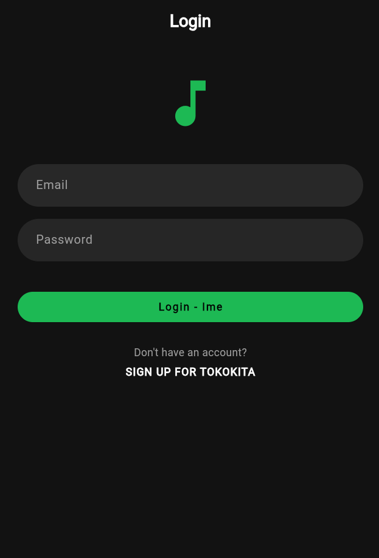


### 2. Registrasi Page `registrasi.dart`
Halaman untuk pendaftar [pengguna baru]

#### Penjelasan Kode
- Menggunakan logika `if (value != _passwordTextboxController.text)` pada validator konfirmasi password.
- Menggunakan setState untuk mengubah status tombol menjadi indikator `loading (CircularProgressIndicator)` saat ditekan.
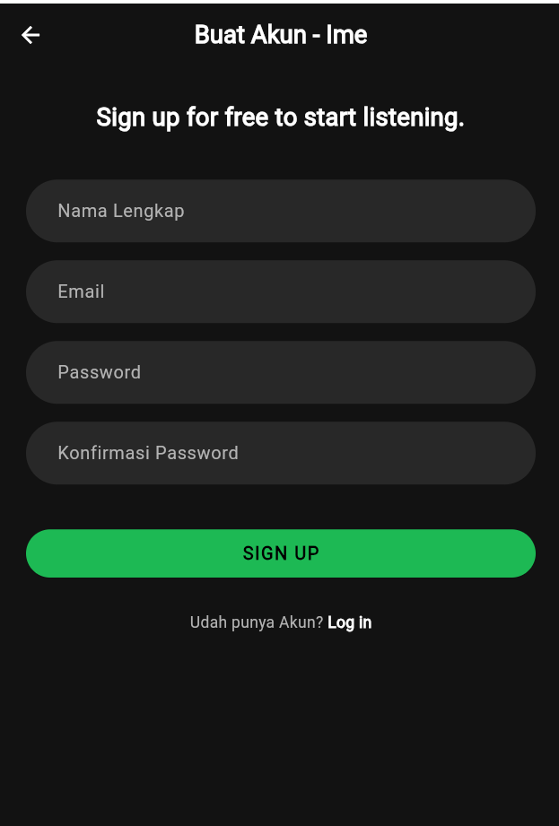

### 3. Produk Page `produk_page.dart`
Halaman utama (Dashboard) yang menampilkan daftar semua produk.

#### Penjelasan Kode
- Menggunakan widget `GestureDetector` pada setiap item list untuk mendeteksi ketukan (tap) yang akan mengarahkan user ke halaman Detail Produk.

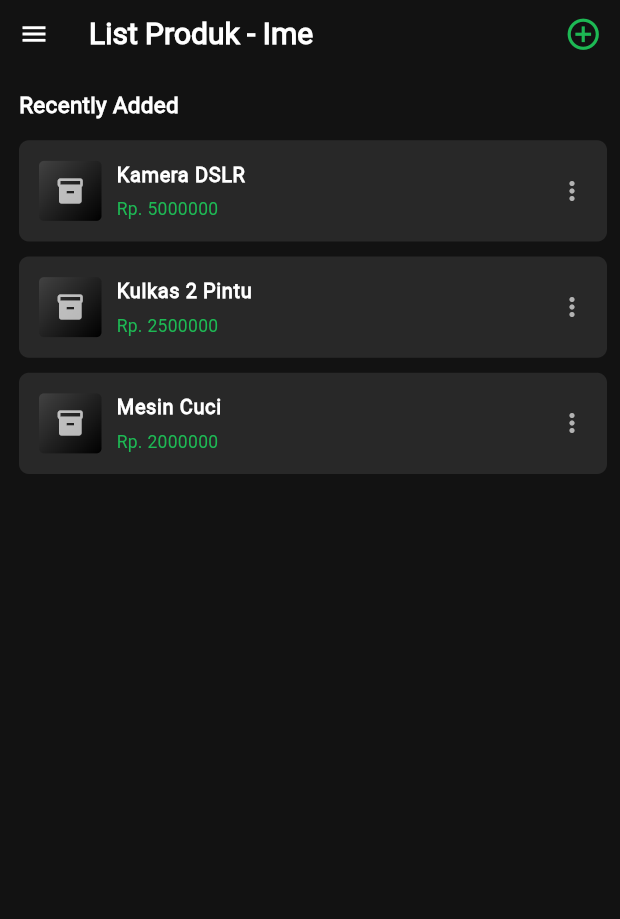
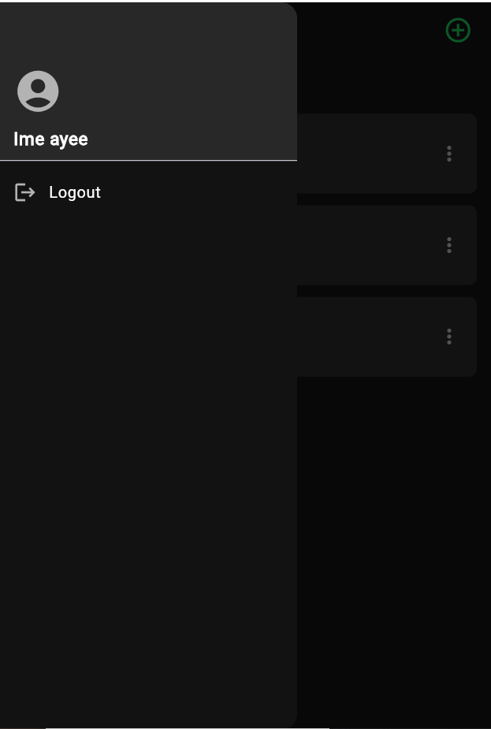


### 4. Detail Page `produk_detail.dart`
Halaman yang menampilkan informasi lengkap dari satu produk yang dipilih.

#### Penjelasan Kode
- Menerapkan pengecekan `if (widget.produk == null)` untuk mencegah aplikasi crash (layar merah) jika data produk gagal dimuat.
- Menggunakan `Navigator.pop` berulang untuk menutup dialog dan kembali ke halaman list setelah penghapusan.

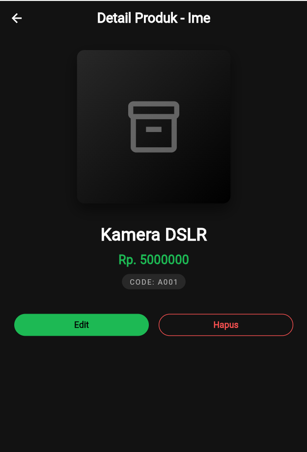


### 5. Produk Form `produk_form.dart`
Halaman formulir yang bersifat reusable (dapat digunakan kembali) untuk dua fungsi: Menambah Produk Baru dan Mengedit Produk Lama.

#### Penjelasan Kode
- Menggunakan widget `GestureDetector` pada setiap item list untuk mendeteksi ketukan (tap) yang akan mengarahkan user ke halaman Detail Produk.


-----
# Tugas 9 - Pertemuan 11

## 1. Proses Autentikasi

### A. Registrasi Member
Proses pendaftaran pengguna baru sebelum bisa masuk ke aplikasi.

**Mengisi Form Registrasi**
Pengguna memasukkan Nama, Email, Password, dan Konfirmasi Password. Validasi dilakukan untuk memastikan data tidak kosong dan format email benar.
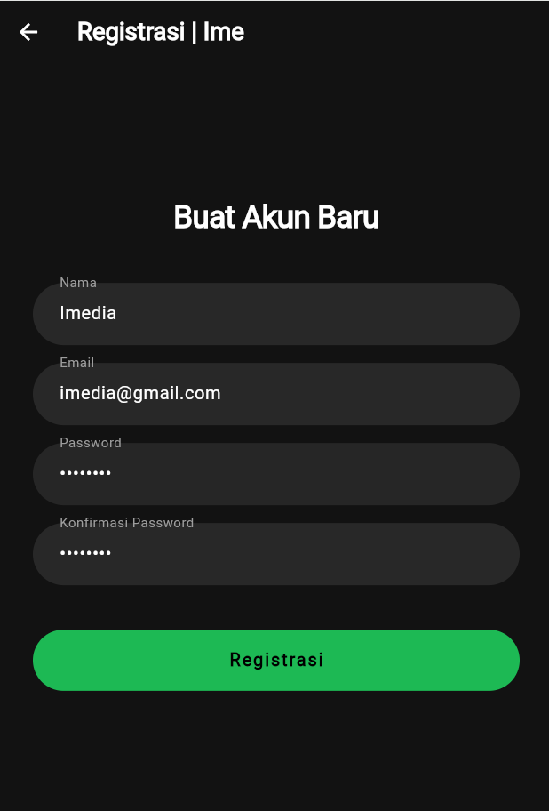

**Kode Logic (UI Validator):**
```dart
// Validasi Email di RegistrasiPage
validator: (value) {
  if (value == null || value.trim().isEmpty) {
    return 'Email harus diisi';
  }
  // Regex untuk cek format email
  final regex = RegExp(r"^[\w-\.]+@([\w-]+\.)+[\w-]{2,4}");
  if (!regex.hasMatch(email)) {
    return 'Email tidak valid';
  }
  return null;
},
```

**Notifikasi Berhasil/Gagal**
Jika sukses, muncul dialog sukses. Jika email sudah terdaftar, muncul peringatan.
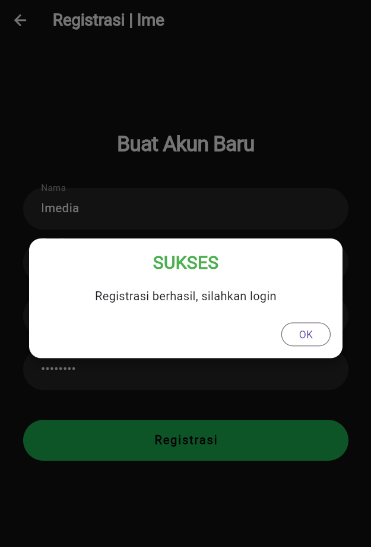
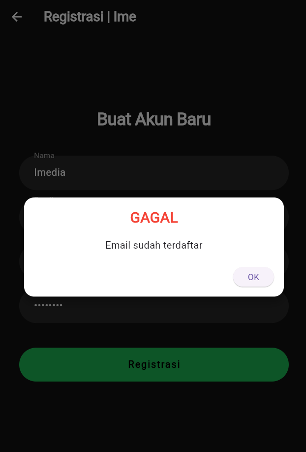


**Kode Logic (Bloc):**
```Dart
// Memanggil API Registrasi
RegistrasiBloc.registrasi(
  nama: _namaTextboxController.text,
  email: _emailTextboxController.text,
  password: _passwordTextboxController.text,
).then((value) {
    // Jika sukses (Code 200)
    if (value.code == 200) {
       showDialog(..., builder: (context) => SuccessDialog(...));
    }
});
```

B. Login
Proses masuk ke dalam aplikasi menggunakan Email dan Password yang sudah didaftarkan.
**Input Kredensial** 
Pengguna menginputkan email dan password. Input password disembunyikan (obscure text).
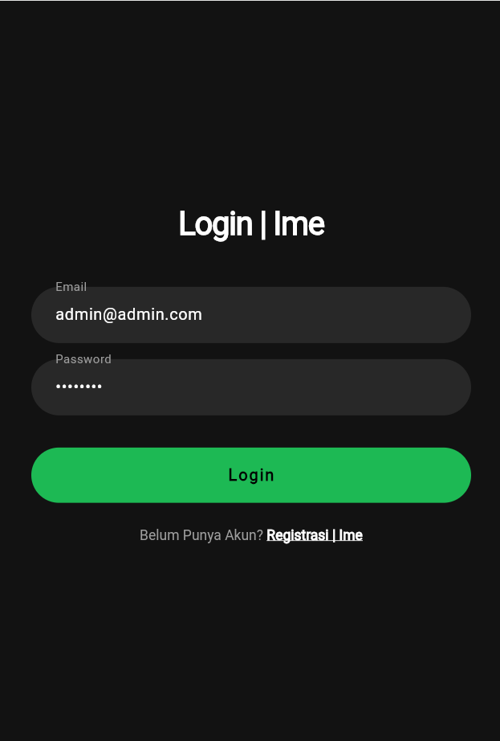

**Proses Autentikasi & Penyimpanan Token**
Sistem mengirim data ke server. Jika cocok, server mengembalikan Token dan User ID. Aplikasi menyimpan data ini ke local storage (UserInfo) untuk sesi login.
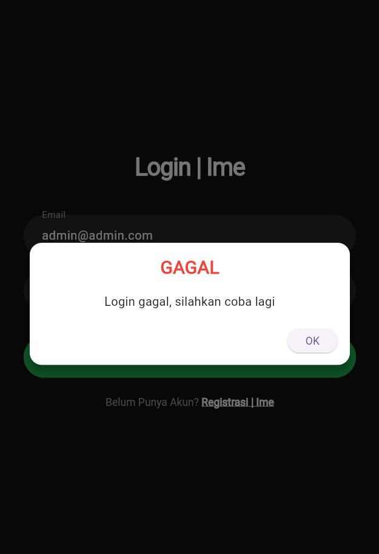

**Kode Logic (LoginBloc & UserInfo):**
```dart
LoginBloc.login(
  email: _emailTextboxController.text,
  password: _passwordTextboxController.text,
).then((value) async {
    if (value.code == 200) {
      // Simpan Token & ID ke Memori HP
      await UserInfo().setToken(value.token.toString());
      await UserInfo().setUserID(int.parse(value.userID.toString()));
      
      // Pindah ke Halaman Produk
      Navigator.pushReplacement(..., builder: (context) => const ProdukPage());
    } else {
      showDialog(..., builder: (context) => const WarningDialog(...));
    }
});
```

## 2. Proses CRUD Data Produk
### A. Menampilkan Data (Read)
Menampilkan daftar produk yang diambil dari database via API.

**List Produk (Halaman Utama)**
Halaman ini menggunakan FutureBuilder untuk menunggu data dari server. Jika data ada, ditampilkan dalam bentuk List.
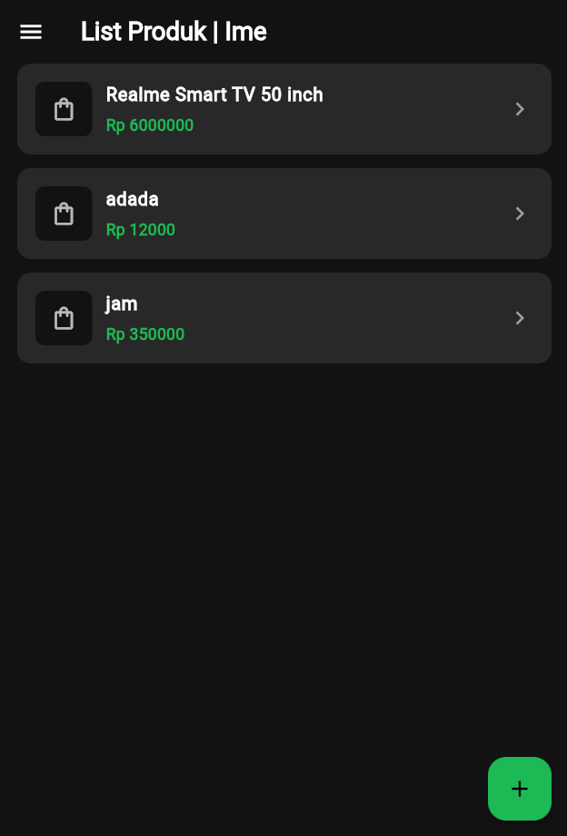
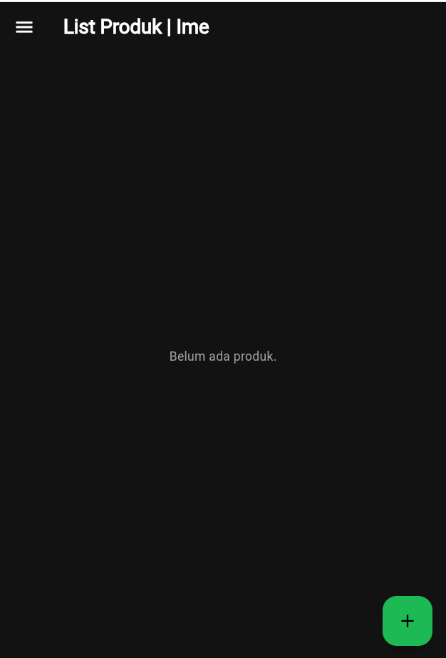

**Kode Logic (ProdukBloc - Get):**
```dart
// Mengambil list produk dari API
static Future<List> getProduks() async {
  String apiUrl = ApiUrl.listProduk;
  var response = await Api().get(apiUrl);
  var jsonObj = json.decode(response.body);
  List<dynamic> listProduk = (jsonObj as Map<String, dynamic>)['data'];
  
  // Konversi JSON ke List Model Produk
  List<Produk> produks = [];
  for (int i = 0; i < listProduk.length; i++) {
    produks.add(Produk.fromJson(listProduk[i]));
  }
  return produks;
}
```

**Detail Produk**
Saat salah satu item diklik, aplikasi menavigasi ke ProdukDetail dan mengirimkan objek produk melalui parameter.
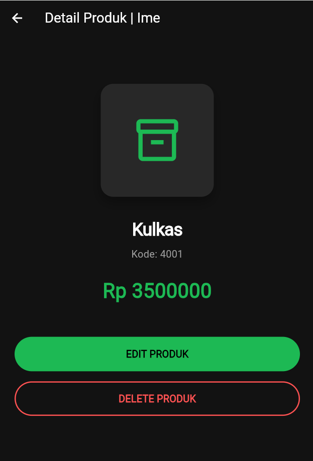

### B. Tambah Data
Menambahkan produk baru ke database.
**Form Tambah Produk**
Pengguna menekan tombol Floating Action Button (+) di halaman list, lalu mengisi Kode, Nama, dan Harga.
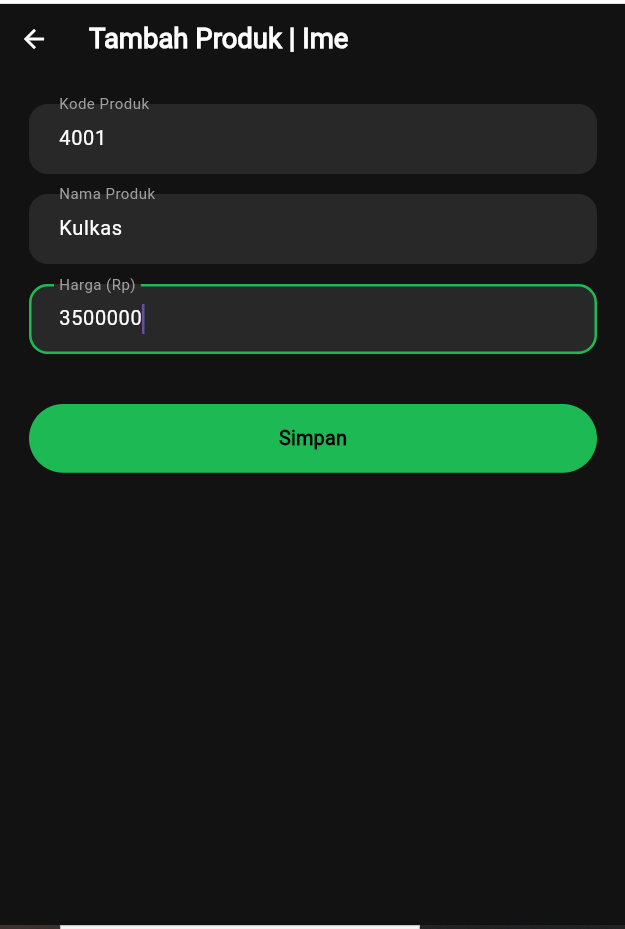

**Proses Simpan** 
Saat tombol "SIMPAN" ditekan, fungsi simpan() dipanggil.

**Kode Logic (ProdukForm - Simpan):**
```dart
void simpan() {
  // Membuat object produk baru
  Produk createProduk = Produk(id: null);
  createProduk.kodeProduk = _kodeProdukTextboxController.text;
  createProduk.namaProduk = _namaProdukTextboxController.text;
  createProduk.hargaProduk = int.parse(_hargaProdukTextboxController.text);
  
  // Kirim ke Bloc
  ProdukBloc.addProduk(produk: createProduk).then((value) {
      // Jika sukses, kembali ke list dan refresh
      Navigator.of(context).pushAndRemoveUntil(...);
  }, onError: (error) {
      showDialog(...); // Tampilkan error jika gagal
  });
}
```

### Edit Data
Mengedit data produk yang sudah ada.
**Form Edit**
Dari halaman Detail, pengguna menekan tombol "EDIT". Halaman ProdukForm terbuka, namun kali ini form sudah terisi otomatis dengan data produk yang dipilih.
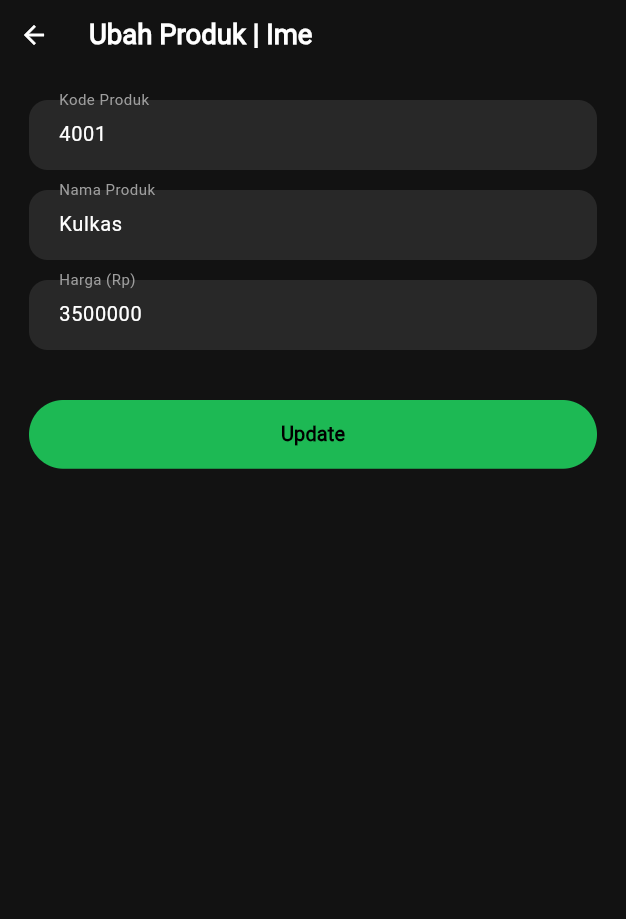

**Kode Logic (InitState):**
```dart
// Mengecek apakah ini mode Tambah atau Ubah
void isUpdate() {
  if (widget.produk != null) {
    // Jika data produk ada, isi form
    judul = "UBAH PRODUK";
    _kodeProdukTextboxController.text = widget.produk!.kodeProduk!;
    _namaProdukTextboxController.text = widget.produk!.namaProduk!;
    // ... dst
  }
}
```
**Proses Update** 
Saat tombol "UPDATE" ditekan, fungsi ubah() dipanggil.

**Kode Logic (ProdukBloc - Update):**
```dart
static Future updateProduk({required Produk produk}) async {
  String apiUrl = ApiUrl.updateProduk(produk.id!);
  var body = {
    "kode_produk": produk.kodeProduk,
    "nama_produk": produk.namaProduk,
    "harga": produk.hargaProduk.toString()
  };
  // Mengirim method PUT ke API
  var response = await Api().put(apiUrl, jsonEncode(body));
  var jsonObj = json.decode(response.body);
  return jsonObj['status'];
}
```

### Hapus Data
**Menghapus produk dari database.**
Konfirmasi Hapus Di halaman Detail, pengguna menekan tombol "DELETE". Dialog konfirmasi muncul untuk mencegah ketidaksengajaan.
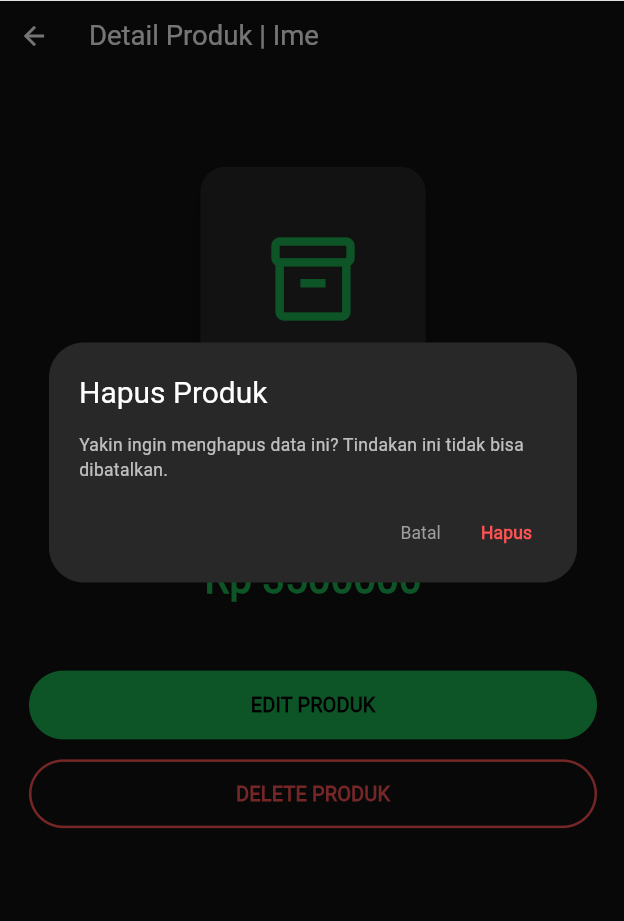

**Eksekusi Hapus**
Jika pengguna memilih "Hapus", fungsi confirmHapus() dijalankan.

**Kode Logic (ProdukDetail - Hapus):**
```dart
ProdukBloc.deleteProduk(id: int.parse(widget.produk!.id!)).then((value) {
    // Jika sukses dihapus, kembali ke halaman list
    Navigator.of(context).pushReplacement(
       MaterialPageRoute(builder: (context) => const ProdukPage())
    );
});
```
## Logout
Menghapus sesi login dari aplikasi.

Proses: Pengguna membuka Drawer (Menu Samping) -> Klik Logout. Aplikasi menghapus Token dari memori HP dan kembali ke halaman Login.
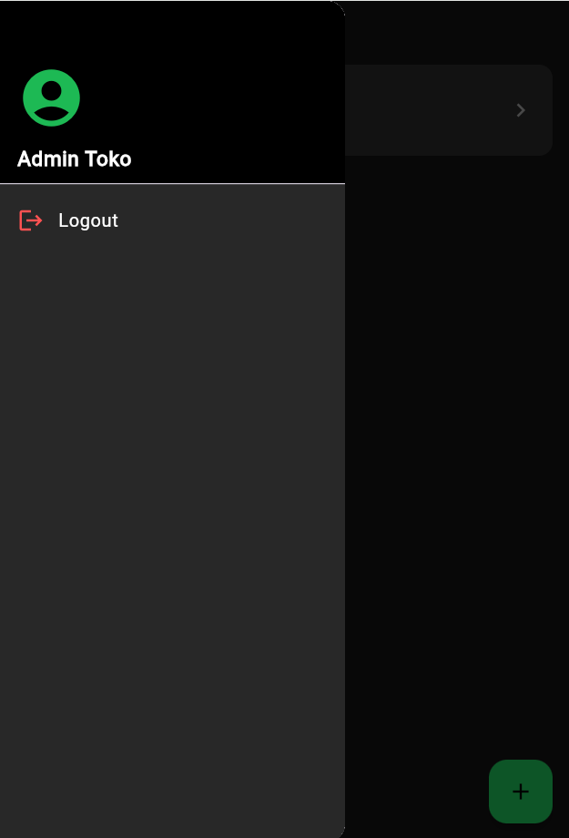

**Kode Logic:**
```dart
class LogoutBloc {
  static Future logout() async {
    // Hapus data sesi
    await UserInfo().logout();
  }
}
```